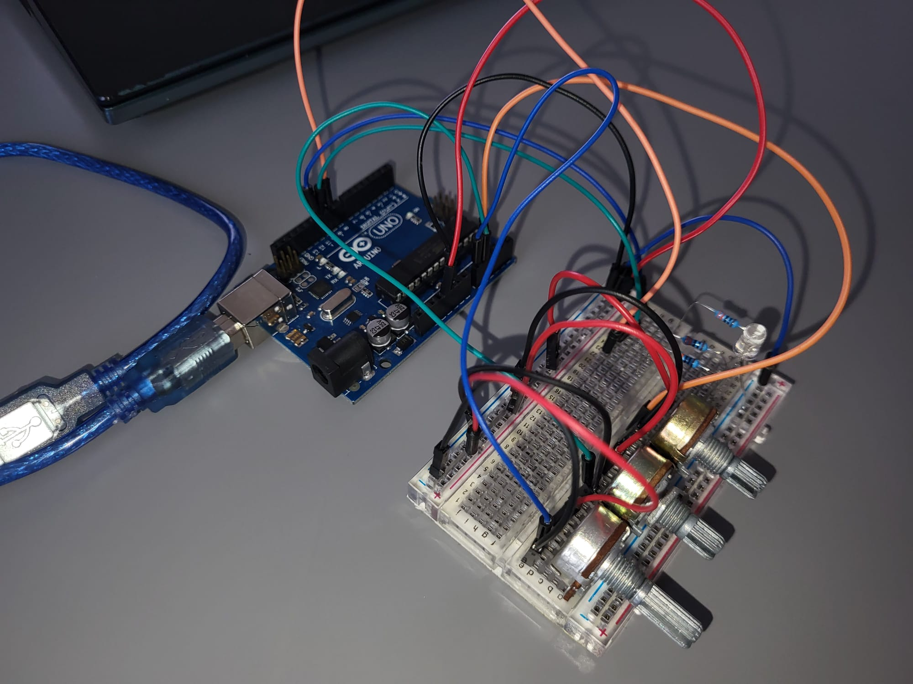
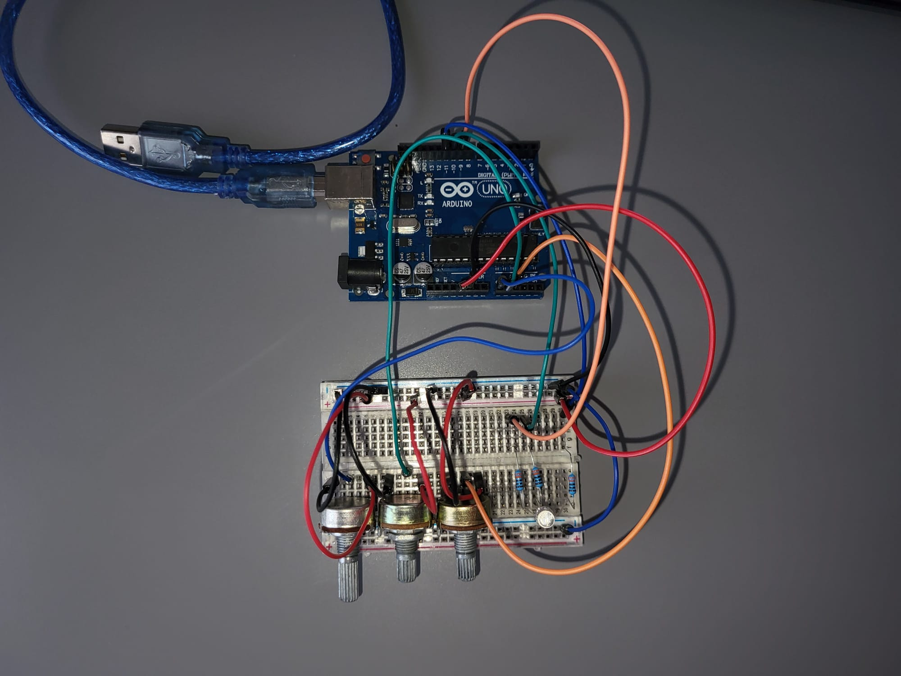
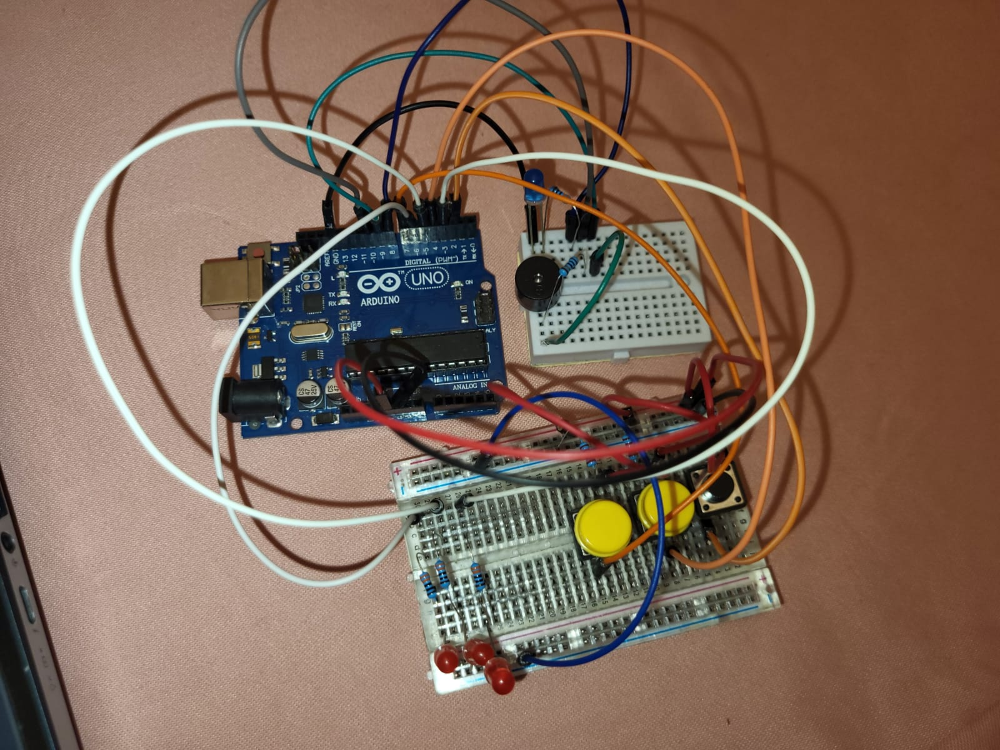

# Introducere-Robotica

This is a repository containing the homeworks for the "Introduction to Robotics" course, taken over the first semester of the third year of studies at the Faculty of Mathematics and Computer Science, University of Bucharest.

Each homework will include the implemetation details and strategies and code, as well as physical requirements.

# Homework 1
## RGB LED w/ 3 potentiometers

The task for this homework is to use an Arduino Board to read the analog values from three potentiometers and transmit them over the analog output pins to our RGB LED. 
Each potentiometer is associated with one of the colors.

Physical requirements:
  - Arduino Board
  - Breadboard
  - Potentiometer x3
  - RGB LED
  - 330 Ohm Resistor x3
  - Wires

Link to the video showcasing the functionality: https://youtu.be/310TrTj0omM

# Homework 2
## Elevator Simulator

The task for this homework is to use an Arduino Board to simulate an elevator. The elevator has and 3 buttons and three LEDs, representing the three floors. The elevator can be called from any floor and it will move to it. A buzzer is used to emmit sounds that represent the movement of the elevator, as well as the opening and closing of the doors. Another LED is used to show the state of the elevator.

Physical requirements:
  - Arduino Board
  - Breadboard
  - Button x3
  - LED x4
  - Buzzer
  - 330 Ohm Resistor for LED x4
  - 10k Ohm Resistor for pull-down button x3
  - 10 Ohm Resistor for lower volume buzzer sound
  - Wires

Link to the video showcasing the functionality: https://youtu.be/mrRqRWHTR4w