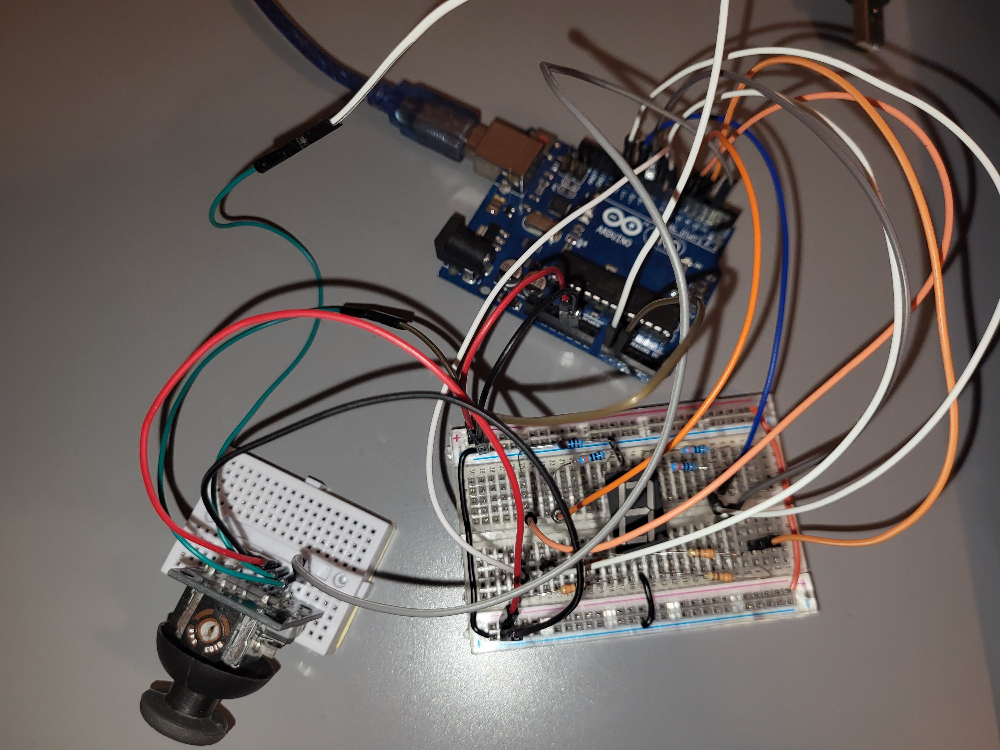
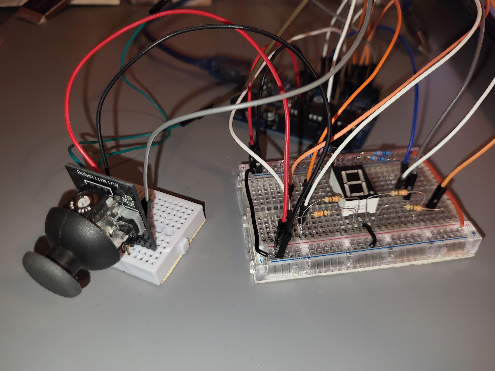
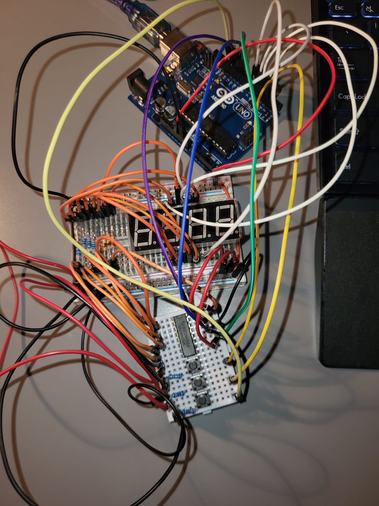
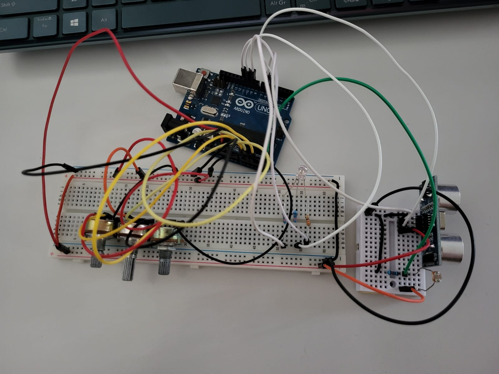

# Introducere-Robotica

This is a repository containing the homeworks for the "Introduction to Robotics" course, taken over the first semester of the third year of studies at the Faculty of Mathematics and Computer Science, University of Bucharest.

Each homework will include the implemetation details and strategies and code, as well as physical requirements.

# Homework 1

RGB LED w/ 3 potentiometers

The task for this homework is to use an Arduino Board to read the analog values from three potentiometers and transmit them over the analog output pins to our RGB LED. 
Each potentiometer is associated with one of the colors.

Physical requirements:
  - Arduino Board
  - Breadboard
  - Potentiometer x3
  - RGB LED
  - 330 Ohm Resistor x3
  - Wires

Link to the video showcasing the functionality: https://youtu.be/310TrTj0omM

# Homework 2

Elevator Simulator

The task for this homework is to use an Arduino Board to simulate an elevator. The elevator has and 3 buttons and three LEDs, representing the three floors. The elevator can be called from any floor and it will move to it. A buzzer is used to emmit sounds that represent the movement of the elevator, as well as the opening and closing of the doors. Another LED is used to show the state of the elevator.

Physical requirements:
  - Arduino Board
  - Breadboard
  - Button x3
  - LED x4
  - Buzzer
  - 330 Ohm Resistor for LED x4
  - 10k Ohm Resistor for pull-down button x3
  - 10 Ohm Resistor for lower volume buzzer sound
  - Wires

Link to the video showcasing the functionality: https://youtu.be/mrRqRWHTR4w

# Homework 3

7 Segment Display Drawing

The task for this homework is to use an Arduino Board and a joystick to draw on a 7 Segment Display. The joystick is used to move from one segment to another, and the switch is used for selecting the segment and leaving it lit, even after moving onto another or for deselecting it. Keeping the switch pressed will clear the display.

Physical requirements:
  - Arduino Board
  - Breadboard
  - Joystick
  - 7 Segment Display
  - 330 Ohm Resistor for segments x8
  - Wires

Link to the video showcasing the functionality: https://youtu.be/K0G9w6SNDi8

# Homework 4

4 Digit 7 Segment Display Timer

The task for this homework is to use an Arduino Board and a 4 digit 7 segment display to create a timer with a precision of one tenth of a second. We have three buttons, one for start/pause, one for reset and one for lap. The timer will start counting when the start button is pressed, and it will stop when the start button is pressed again. The reset button will reset the timer to 0, and the lap button will save up to 4 separate lap times, which can be seen by pressing the lap button again, once the timer is paused.

The physical build leads to the buttons being very noisy, so i had to implement some debouncing for all the functions in each of them. When checking the Serial debugging messages, we can see that the funcionality is correct, but the noisiness of the buttons leads to some unwanteed behaviour(entering other functions when pressing a button).

Physical requirements:
  - Arduino Board
  - Breadboard
  - 4 Digit 7 Segment Display
  - Button x3
  - 10 kOhm Resistor for pull-down button x3
  - 330 Ohm Resistor for segments x8
  - 74hc595 Shift Register
  - Wires

Link to the video showcasing the functionality: https://youtu.be/OoD-L4Js9JM

# Homework 5

Pseudo-Smart Environment Monitor and Logger

The task for this homework is to use an Arduino Board, a light sensor and a distance one to make an interactive environment monitor. The light sensor will be used to detect the light intensity in the room, and the distance sensor will be used to detect the distance to the closest object in front of it. The user has access to multiple menus and submenus that allow them to modify settings, such as the threshold for the measurings, the sampling interval, and writing to memory or resetting the taken measurments.

Physical requirements:
  - Arduino Board
  - Breadboard
  - LDR Sensor
  - Ultrasonic Distance Sensor
  - RGB LED
  - Potentiometer x3
  - 10 kOhm Resistor for pull-down
  - 330 Ohm Resistor for RGB LED
  - Wires

Link to the video showcasing the functionality: https://youtu.be/eTRS-AF6Z8Y

